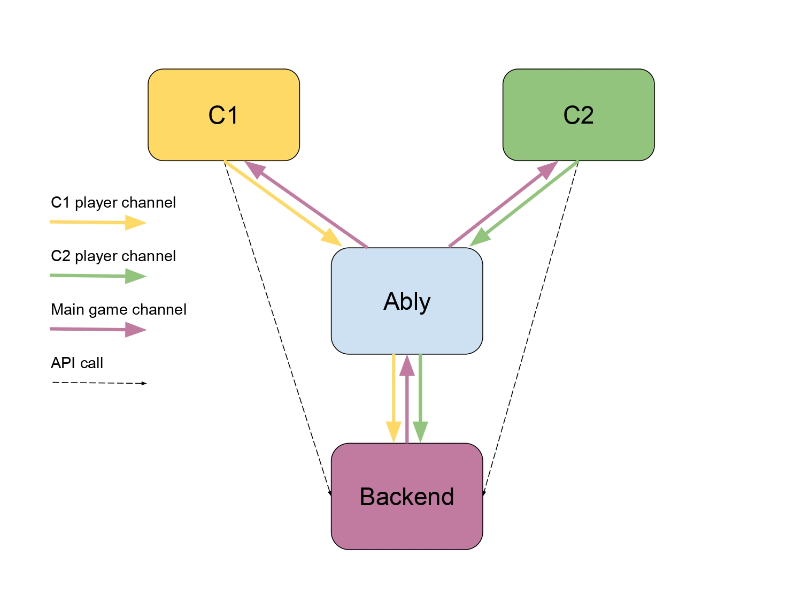
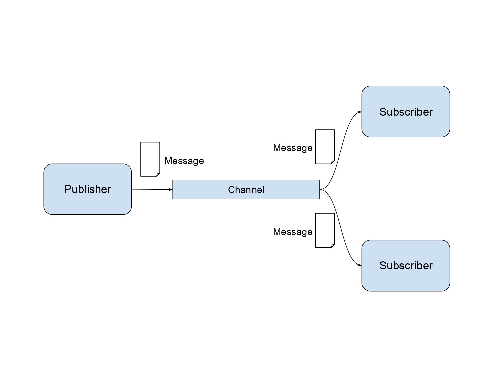

# Project 1: Convergence

## Introduction

Welcome to the first project of CS 51B! In this project, you will use what you learned from the Frontend Masters Bootcamp to build a browser-based multiplayer word game called Convergence. We have provided the backend of this app; you will create the frontend.

By the end of this project, you should have a fully functional game that users can play. You will even be able to deploy the app if you choose to make it accessible for everyone online!

An introduction of the project and walkthrough of this project spec in video form can be found below.

<iframe width="560" height="315" src="https://www.youtube.com/embed/D36lgepGr9s?si=Nn5vvGJapLy1rAbc" title="YouTube video player" frameborder="0" allow="accelerometer; autoplay; clipboard-write; encrypted-media; gyroscope; picture-in-picture; web-share" referrerpolicy="strict-origin-when-cross-origin" allowfullscreen></iframe>

## Convergence Rules

The easiest way to understand the rules is to watch the demo portion of the walkthrough above. You can also play around with the staff's solution to this project at [google.com](google.com).

{: .note }
Your frontend can and should be better than ours! Our barebones version simply shows the basic game functionality.

### Basic Rules

The objective of the game is for the players to converge on a single word. The game starts with each player submitting a word. After that, each round proceeds as follows:

1. The unique submitted words from the previous round are the new target words for the current round.
1. If there was only one unique word (all the words matched), then the players have converged and the game is finished!
1. Otherwise, based on the target words, each player comes up with a new word.
1. The first N words submitted will be taken as the round's submitted words, where N is the number of unique target words.
1. Repeat from step 1.

Valid words must be a single word (no spaces) and new (not used in a previous round).

Below is a sample playthrough of the game, taken from the video above.

| round | player 1 | player 2 | player 3 |
|:------|:---------|:---------|:---------|
| 1     | dog      | bottle   | computer |
| 2     | water    | water    | thing    |
| 3     |          | drop     | drop     |

Because both words match in round 3, the game is finished!

## Architecture

This is an architecture diagram that shows the different components involved in building the convergence application. It is extremely common to create one of these as part of the engineering design process to visually represent what will be built.

Each box represents a *service*, which is basically code running somewhere that provides some functionality, whether that be code in someone's browser (`C1` and `C2`), a REST API service (`Backend`), or a realtime Pub/Sub service (`Ably`). Each line or arrow represents an interaction between two services. Usually, a line or arrow just indicates that API calls are made, but because our app is live and multiplayer, we need some realtime communication as well. Therefore, you'll primarily see *Pub/Sub channels* being used for interaction between the services.

**Don't worry if you're confused by all of this right now!** We'll explain what Pub/Sub channels are and walk through each part of the diagram in detail below.

### Pub/Sub Channels

Pub/Sub channels are one of many ways for services to communicate in realtime. To understand why we need these in our app, let's consider what would happen if we tried to only use HTTP REST API calls.

A client would first make a REST API call to the backend to create a new game. That's totally fine and exactly what happens in our app. But how does that client know when other players join the game that was just made? With REST API calls only, the client would need to continually call the backend and ask if any new players joined. There's no way for the backend to be able to tell the client(s) when someone joins. The same problem exists for all the other parts of the game that require synchronization, such as when players leave, when players submit words, when rounds are completed, etc.

So how do Pub/Sub channels work to solve this? *Pub/Sub* stands for Publish/Subscribe, which describes the basic premise. Publishers can publish *messages*, or pieces of data, to *channels*. Subscribers can subscribe to channels and receive new messages published to those channels in realtime. A channel can have any number of publishers and subscribers, and subscribers each receive a copy of every new published message.

This is perfect for our application! Our backend service can publish game updates to a single main game channel when players enter/leave, words are submitted, rounds end, etc. Every client that joins a game can simply subscribe to that game's main channel to stay up to date. We can also use channels for players to communicate with the backend as well, although in that case, each channel only has one publisher and subscriber.

### Ably

Instead of implementing Pub/Sub functionality from scratch, we can use a third party service that provides that functionality to us. That's what the Ably box is for in the architecture diagram. [Ably](https://ably.com/) provides the ability to publish and subscribe to channels as well as many other features.

Ably provides one feature in particular that is helpful for our application. That feature is called [presence](https://ably.com/docs/presence-occupancy/presence). You can think of it as an additional optional channel tied to an existing channel that's specifically used for indicating when players enter and leave. We use the presence feature for the main game channel to indicate when players enter/leave a game.

For more information about Ably's Pub/Sub Channels offering, refer to [their docs](https://ably.com/docs/products/channels). These could be helpful as you work with channels in this project as well.

### C1 and C2

The C1 and C2 boxes refer to clients (players) running the frontend code that you will be implementing. The architecture diagram shows two players just to illustrate that the player channels are created per-player but not the main game channel. Any number of players could be in the app and in a single game at once.

### Backend

The backend service provides a few HTTP REST *API endpoints*, or URLs that accept API calls and produce the desired responses. The only API endpoints that you need to call are:

* `POST /games` for creating new games
* `GET /games/{gameId}` for getting the existence/status of games

The backend service also publishes game state messages to the main game channel and receives messages from player channels. The details about message names and fields is provided in the [backend API documentation](https://github.com/kevinwang27/convergence?tab=readme-ov-file#convergence). Most of the work will be processing and/or sending these messages properly, so you'll definitely need to take a look!

## Assignment

### Setup

1. [Install Golang (Go)](https://go.dev/doc/install). The backend is built in Go, and you'll need to use Go commands to run the application.
1. Clone the convergence repo: `git clone git@github.com:kevinwang27/convergence.git && cd convergence`.

{: .note }
You may see an SSH error if you haven't set up an SSH key for Github access before. Follow [these instructions](https://docs.github.com/en/authentication/connecting-to-github-with-ssh/generating-a-new-ssh-key-and-adding-it-to-the-ssh-agent?platform=mac) and try to run the clone command again.

3. Checkout the skeleton code: `git checkout skeleton`
1. Create a new branch: `git checkout -b chearim`. This is where you'll be developing.
1. Install dependencies: `go mod download`.
1. Test run the server.

{: .note }
In order to run the server, you'll need a key to authenticate with Ably. Please contact a staff member and they will send you the key.

    1. `ABLY_KEY=<key> go run server.go`.
    1. Navigate to `localhost:8080` in your browser.
    1. You should see a basic page with `Convergence` and a `ping` button. Click `ping` to contact the backend server. If a `pong` response shows up, then everything is set up properly!
    1. Use `Ctrl-C` in your terminal to stop the server.

### Code Structure

The backend service is provided by `server.go`. `gamedb/` and `gamehelper/` are helper packages for the backend. You do not need to touch any of these, although you are free to if you would like to change or implement anything!

The backend server also statically serves the frontend files that you will be implementing. The frontend files all reside in `views/`, and so long as you don't change the folder name, everything should work properly.

## Helpful Links

* [Ably Pub/Sub Channels docs](https://ably.com/docs/products/channels)
* [Ably Realtime SDK docs](https://ably.com/docs/api/realtime-sdk)
* [Backend service docs](https://github.com/kevinwang27/convergence?tab=readme-ov-file#convergence)
* [Git tutorial](https://www.atlassian.com/git)
